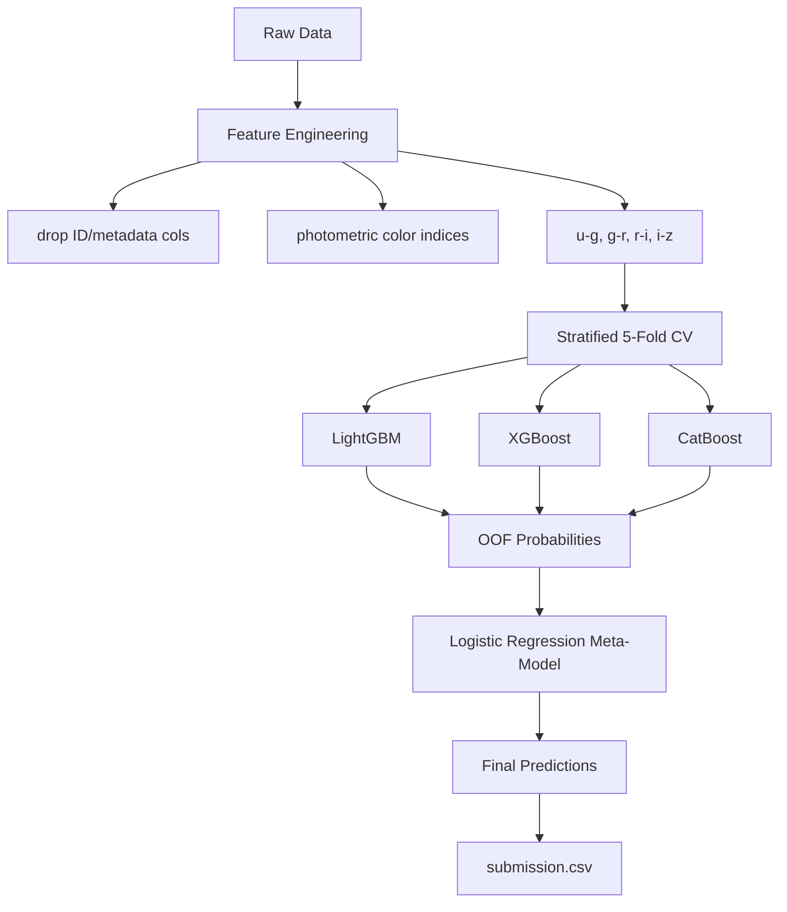

# kcom-predicting-stellar-class

Kaggle Competition: [Predicting Stellar Class](https://www.kaggle.com/competitions/playground-series-s6e6) (Playground Series S6E6)

Classify astronomical objects from the Sloan Digital Sky Survey (SDSS) into **GALAXY**, **STAR**, or **QSO**.

**Evaluation Metric:** Balanced Accuracy  
**Deadline:** June 30, 2026

## Happy Path — One Command

```bash
# Requires Kaggle API token (see setup below)
make all
```

This single command runs the entire pipeline:

```mermaid
graph LR
    A[make all] --> B[make install]
    B --> C[uv sync + auth]
    C --> D[make download]
    D --> E[fetch data from Kaggle]
    E --> F[make train]
    F --> G[train 5-fold ensemble]
    G --> H[save submission.csv]
    H --> I[make submit]
    I --> J[upload to Kaggle]
    J --> K[show leaderboard]
```



## Kaggle API Setup

```bash
# Option A: Set environment variable
export KAGGLE_API_TOKEN=KGAT_<your-token>

# Option B: Write token to file
echo -n "KGAT_<your-token>" > .kaggle/access_token
chmod 600 .kaggle/access_token

# Get your token at: https://www.kaggle.com/settings -> API -> Create New Token
```

## Detailed Step-by-Step

```bash
# 1. Install dependencies + authenticate
make install

# 2. Download competition data
make download

# 3. Train ensemble & generate submission
make train

# 4. Submit to leaderboard
make submit

# 5. Run tests
make test
```

## Custom Submission

```bash
# Submit a different file with custom message
make submit SUBMISSION_FILE=outputs/submissions/experiment_v2.csv SUBMISSION_MSG="v2: added spectral_type encoding"
```

## Development

```bash
make lint      # ruff check
make format    # ruff format
make test      # pytest
make submit    # submit to Kaggle leaderboard
```

## Repository Structure

```
├── config/config.yaml          # Experiment configuration
├── data/                       # Train/test CSVs (download with make download)
├── src/stellar/                # Python package
│   ├── data.py                 # Data loading & preprocessing
│   ├── features.py             # Feature engineering (color indices)
│   └── models.py               # LGBM + XGB + CatBoost + stacking ensemble
├── scripts/
│   ├── train.py                # End-to-end training pipeline
│   └── predict.py              # Inference & submission generation
├── tests/
│   ├── test_models.py          # Unit tests
│   └── test_integration.py     # Integration tests (synthetic data)
├── outputs/submissions/        # Generated submission CSVs
├── Makefile                    # Automation targets
└── pyproject.toml              # Project & dependency config (uv sync)
```

## Pipeline Architecture



## Approach

1. **Feature Engineering** — Drop low-signal ID/scan metadata, derive photometric color indices from SDSS band magnitudes
2. **Base Models** — LightGBM, XGBoost, CatBoost trained with stratified 5-fold cross-validation
3. **Stacking** — Logistic Regression meta-model on out-of-fold probability predictions
4. **Evaluation** — Balanced accuracy (competition metric)


### Beat the Benchmark

```bash
# Download the original SDSS17 dataset for augmentation
uv run kaggle datasets download -d fedesoriano/stellar-classification-dataset-sdss17 -p data/
unzip -o data/stellar-classification-dataset-sdss17.zip -d data/
mv data/star_classification.csv data/original.csv
rm data/stellar-classification-dataset-sdss17.zip

# Train the final model (~22 min on CPU)
make train CONFIG=config/experiments/final.yaml RUN_NAME=final

# Compare against all prior experiments
uv run python scripts/compare.py

# Submit to the public leaderboard
make submit SUBMISSION_FILE=outputs/runs/<timestamp>_final/submission.csv \
           SUBMISSION_MSG="final: augment + interactions + 5-fold/1000 + threshold tuning (OOF 0.9641)"
```

The canonical submission is also at `outputs/submissions/submission.csv` after
training. To re-predict without retraining:

```bash
uv run python scripts/predict.py --run-dir outputs/runs/<timestamp>_final
```
