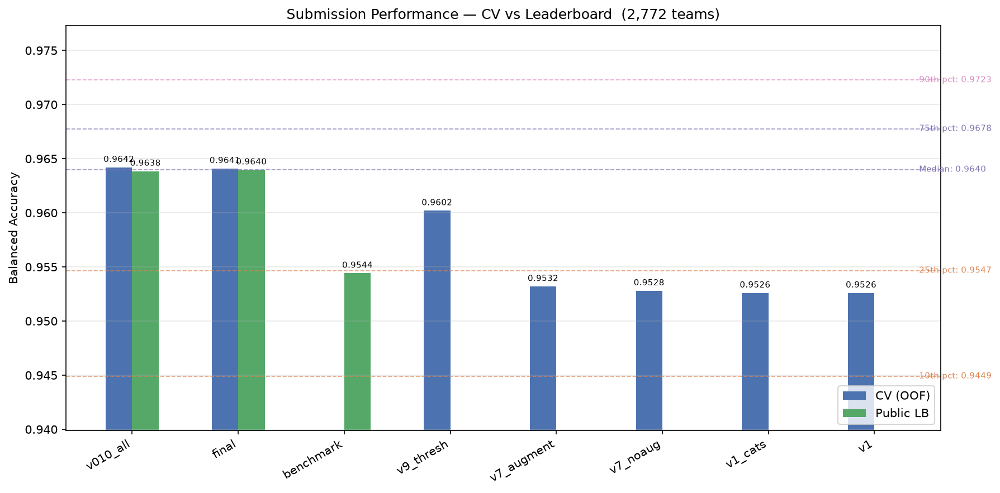
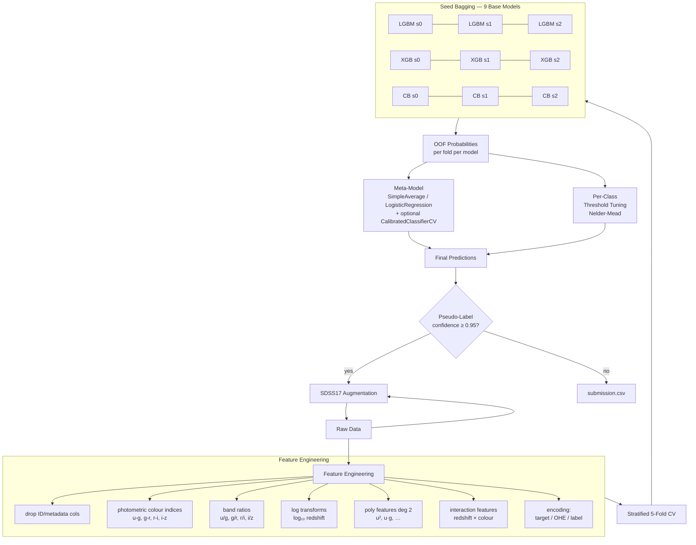

# kcom-predicting-stellar-class

Classify SDSS astronomical objects as **GALAXY**, **STAR**, or **QSO**.
[Kaggle Playground Series S6E6](https://www.kaggle.com/competitions/playground-series-s6e6) · Metric: **balanced accuracy** · Deadline: June 30, 2026

## Results



| Submission | CV (OOF) | Public LB | Private LB |
|---|---|---|---|
| benchmark (v001) | 0.9526 | 0.9544 | — |
| **final** (augment + interactions + 5-fold/1000 + threshold tuning) | **0.9641** | **0.9640** | — |

**Leaderboard context** (2,398 teams on public LB):

| Percentile | Score | My rank |
|---|---|---|
| 10th | 0.9448 | — |
| 25th | 0.9548 | benchmark ~25th pct |
| **50th (median)** | **0.9637** | **final ~49th pct (rank ~1,181)** |
| 75th | 0.9676 | — |
| 90th | 0.9714 | — |

Private LB populates after the competition ends. Regenerate after new submissions:

```bash
make visualize
```

**Key levers** (benchmark → final, +0.0115 OOF):
- **Per-class threshold tuning** (+0.0070) — Nelder-Mead simplex search on OOF probabilities, directly optimizing balanced accuracy instead of plain argmax
- **5-fold / 1000 estimators** (+0.0039) — better base models and OOF estimates
- **Original-data augmentation** (+0.0004) — 100k real SDSS17 rows appended to 577k synthetic
- **Interaction features** (+0.0002) — `redshift × colour`, `colour × colour` (helps only when OHE categoricals are dropped)

See [`Iteration.md`](Iteration.md) for the full experiment log and [`docs/experiments/`](docs/experiments/) for per-topic reports.

## Quick Start

```bash
make install          # uv sync + kaggle auth (one-time)
make download         # fetch competition data (one-time)
make train            # train ensemble → submission.csv
make submit           # upload to Kaggle + show leaderboard
```

**Happy path** (full pipeline in one command): `make all`

## Beat the Benchmark

```bash
# 1. Download the original SDSS17 dataset for augmentation
uv run kaggle datasets download -d fedesoriano/stellar-classification-dataset-sdss17 -p data/
unzip -o data/stellar-classification-dataset-sdss17.zip -d data/ && mv data/star_classification.csv data/original.csv

# 2. Train the final model (~22 min on CPU)
make train CONFIG=config/experiments/final.yaml RUN_NAME=final

# 3. Compare against all prior experiments
uv run python scripts/compare.py

# 4. Submit
make submit SUBMISSION_FILE=outputs/runs/<timestamp>_final/submission.csv \
           SUBMISSION_MSG="final: augment + interactions + 5-fold/1000 + threshold tuning"
```

Re-predict without retraining:

```bash
uv run python scripts/predict.py --run-dir outputs/runs/<timestamp>_final
```

## Kaggle API Setup

```bash
# Option A: environment variable
export KAGGLE_API_TOKEN=KGAT_<your-token>

# Option B: token file
echo -n "KGAT_<your-token>" > .kaggle/access_token
chmod 600 .kaggle/access_token

# Get your token at https://www.kaggle.com/settings → API → Create New Token
```

You must **join the competition** (Accept Rules) on the Kaggle page before `make download` works.

## Pipeline



- **Features** — drop metadata/ID, derive SDSS colour indices (`u-g, g-r, r-i, i-z`), add `redshift × colour` interactions
- **Base models** — LightGBM, XGBoost, CatBoost (5-fold stratified CV, 1000 estimators)
- **Meta** — simple average of base-model probabilities + per-class threshold tuning
- **Augmentation** — 100k original SDSS17 rows concatenated with 577k synthetic training rows

## Development

```bash
make lint           # ruff check
make format         # ruff format --check
make format-fix     # apply formatting
make test           # pytest (synthetic data, no Kaggle needed)
make visualize      # regenerate submission score chart
```

Submit a custom file:

```bash
make submit SUBMISSION_FILE=outputs/runs/<name>/submission.csv SUBMISSION_MSG="description"
```

## Repository Structure

```
config/
  config.yaml              # tuned default (5-fold, 1000 estimators)
  baseline.yaml            # fast reference (3-fold, 250 estimators)
  experiments/             # v001–v009 + final.yaml
src/stellar/               # data.py, features.py, models.py, tracking.py
scripts/                   # train.py, predict.py, compare.py, visualize.py
tests/                     # unit + integration (synthetic SDSS-like data)
docs/experiments/          # per-topic experiment reports
outputs/runs/              # timestamped run artifacts (config, metrics, model, submission)
```
